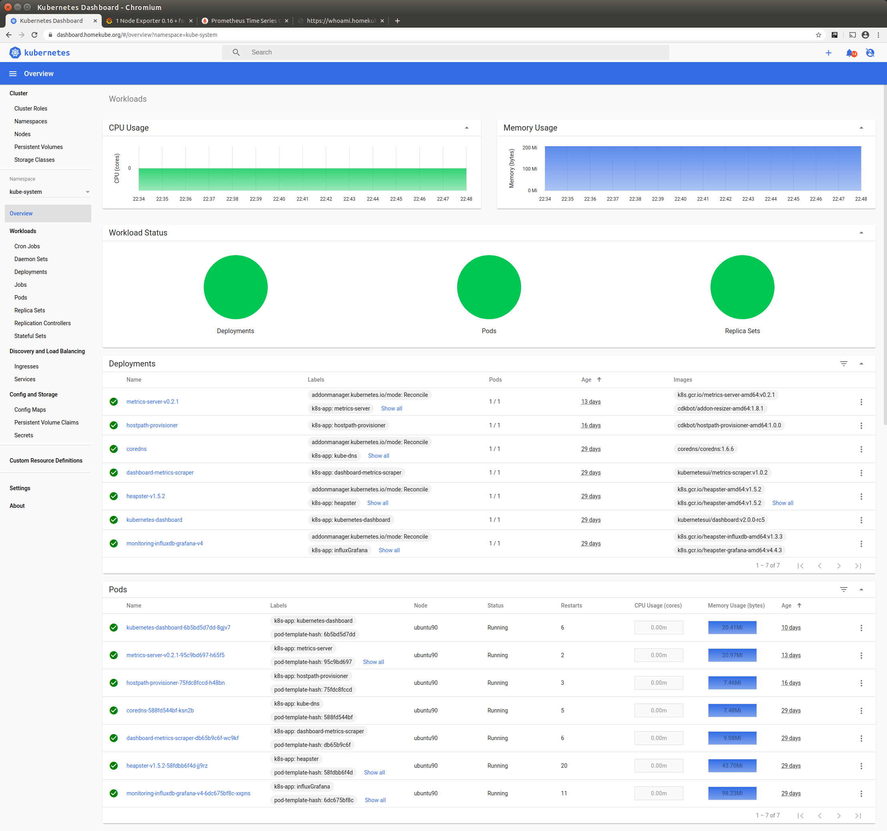

# Kubernetes at home for fun and education

Homekube aims to set up a full operational kubernetes environment on a baremetal Ubuntu server.
There is already a lot of documentation out there and a lot of terminology to learn so what is new and where is the fun part ?

Kubernetes is sort-of the new [Lego](https://lego.com) for adults. If you liked to play with all the bricks and pieces as a child and if you are an IT-minded person you'll probably have some fun with kubernetes too.
Its got lots of components and endless options to glue them altogether and once you have mastered the initial learning steps it unlocks endless possibilities of creativity.

Following this tutorial you should have Kubernetes and a sample application installed as well as the most useful and popular administration components on your local Ubuntu server:

- [Kubernetes **Dashboard**](https://dashboard.homekube.org)
- [**Prometheus** Metrics](https://prometheus.homekube.org)
- [**Grafana** Monitoring](https://grafana.homekube.org)
- [Sample **WhoamI** application](https://whoami.homekube.org)

As an extra step there'll be some instructions on how to make your installation publicly available in the internet.

There are many ways to install Kubernetes locally but for simplicity we'll follow Ubuntu's recommended [**MicroK8s installation recipes**](https://microk8s.io/docs).  
Is this really for you ? If you are in doubt read the [considerations](considerations.md) before you start.

The [MicroK8s docs](https://microk8s.io/docs) we'll follow are pretty much straightforward for the first steps.
However I think its fair to say that once you have installed the basics there is very little guidance on how to proceed to set up a complete working environment including dashboard, monitoring and a sample app.
If you are already familiar with the concepts and terminology thats not a problem for you because you know how to go ahead.
But hey - for the rest of us this means googling like hell and if you really were familiar with that stuff you won't be here - won't you ?
Thats where this tutorial jumps in as a leaflet and reference with pointers to further in-depth documents, concepts and resources.

## Basic installation

#### Requirements

Server requirements are:

* An Ubuntu 20.04 LTS (18.04 LTS or 16.04 LTS will do also [or alternatives linux distros supporting snapd](https://snapcraft.io/docs/installing-snapd))
* At least 20G of disk space and 4G of memory are recommended
* An internet connection

#### Prerequisites

Further its assumed that your server is a separate computer. It might be a VM as well but thats beyond the scope of these instructions.
For the purpose of this tutorial it is assumed that

1) Your homenet is in the portrange `192.168.1.0 - 192.168.1.255` (A class C subnet 192.168.1.0/24) 
2) Your servers ip is fixed `192.168.1.100` and the username is `mykube`
3) You have a free range of unassigned ips that are excluded from your routers dhcp address range.
We will use these addresses to emulate the functionality of a cloud providers LoadBalancer for all your incoming traffic.
These addresses may not be used by any other device in your network. Here we assume this (randomly chosen) portrange is `192.168.1.200 - 192.168.1.220`
You'll need a minimum of 5 IPs but its better to have some headroom for extensions and your own exercises. 

Of course you can choose whatever is appropriate for your environment as long as you modify the commands accordingly.
  
Open a terminal on your computer and connect to your server 
```bash
ssh mykube@192.168.1.100
```
Then follow the [**steps 1-7** in the Microk8s tutorial](https://microk8s.io/docs).
At this point you are done with a base installation and this tutorial will lead you through the next steps of installing the other apps.

Finally in your terminal window execute

```bash
microk8s kubectl version --short
```

The response will be something like
```
Client Version: v1.18.2-41+b5cdb79a4060a3   
Server Version: v1.18.2-41+b5cdb79a4060a3
```

Congrats ! You are done with the first part.

## Next steps

In the next step we'll install the kubernetes dashboard.   
  
[](https://dashboard.homekube.org "Thats the live dashboard you'lll install on your own server")

The MicroK8s docs [contain a chapter on this](https://microk8s.io/docs/addon-dashboard) on how to set up the dashboard.
While its a good excercise to just follow these steps and already learn about terminology and components its hard to imagine that you'll soon fall in love with this kind of installation.
By default the dashboard is just internal to your kubernetes cluster and only accessible from the outside by another command line instruction `microk8s kubectl port-forward -n kube-system service/kubernetes-dashboard 10443:443 --address 0.0.0.0` 

