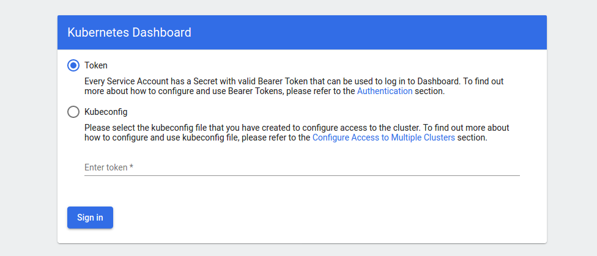

# Dashboard

We do not use the MicroK8s dashboard installation manifests for a 
[ couple of reasons](dashboard-background.md) .
In case its already installed we will **disable** it first.

``
microk8s disable dashboard
``

Instead we just install the upstream 
[ community version](https://github.com/kubernetes/dashboard#kubernetes-dashboard)

```bash
kubectl apply -f https://raw.githubusercontent.com/kubernetes/dashboard/v2.0.1/aio/deploy/recommended.yaml
```

Lets quickly check the installation. `192.168.1.100` is our server ip when following the prerequisites.

```bash
kubectl expose service kubernetes-dashboard --external-ip 192.168.1.100 --port 10443 --name dashboard -n kubernetes-dashboard
``` 
In case of problems exposing the installed manifests there is an 
[ alternative access](dashboard-background.md) in the  `Port-forwarding` section.

In your **local browser open `https://192.168.1.100:10443`**

A warning about an untrusted certificate will show up and upon confirmation **in firefox**
you'd see the dashboards sign-in page. 

> **NOTE** In some chrome versions you do not get the option to bypass the `NET::ERR_CERT_INVALID` error.
Due to a
[hidden function in chrome](https://medium.com/@dblazeski/chrome-bypass-net-err-cert-invalid-for-development-daefae43eb12)
it is possible to just type **thisisunsafe** or **badidea** to proceed anyway. 



We take care of the untrusted certificate later.

For login next we create two users. One that has full admin rights and one with limited rights.  
[ Create sample user docs](https://github.com/kubernetes/dashboard/blob/master/docs/user/access-control/creating-sample-user.md)
provide some more instructions.

```bash
kubectl apply -f https://github.com/a-hahn/homekube/src/dashboard/create-admin-user.json
kubectl apply -f https://github.com/a-hahn/homekube/src/dashboard/create-simple-user.json
```
Now we inspect the created secrets (account tokens):

```bash
name=simple-user # or 'simple-user'
namespace=kubernetes-dashboard
token=$(kubectl -n $namespace get secret | grep ${name}-token | cut -d " " -f1)
kubectl -n $namespace describe secret $token 
``` 
From the output copy the **token:** encrypted secret in the DATA section (with a double click) to the clipboard and paste it
into `Enter token *` input field.

```
Name:         simple-user-token-nj2qx
Namespace:    kubernetes-dashboard
Labels:       <none>
Annotations:  kubernetes.io/service-account.name: simple-user
              kubernetes.io/service-account.uid: 0a08fec3-c8dc-4ec2-ae87-bb1ff53b01c3

Type:  kubernetes.io/service-account-token

Data
====
namespace:  20 bytes
token:      eyJhbGciOiJSUzI1NiIsImtpZCI6InVZXzVvdmtBUnp4bmpaczdlVXdLWkhkU3U0QzZReTY1U3ZydlpNWTVqMjgifQ.eyJpc3MiOiJrdWJlcm5ldGVzL3NlcnZpY2VhY2NvdW50Iiwia3ViZXJuZXRlcy5pby9zZXJ2aWNlYWNjb3VudC9uYW1lc3BhY2UiOiJrdWJlcm5ldGVzLWRhc2hib2FyZCIsImt1YmVybmV0ZXMuaW8vc2VydmljZWFjY291bnQvc2VjcmV0Lm5hbWUiOiJzaW1wbGUtdXNlci10b2tlbi1uajJxeCIsImt1YmVybmV0ZXMuaW8vc2VydmljZWFjY291bnQvc2VydmljZS1hY2NvdW50Lm5hbWUiOiJzaW1wbGUtdXNlciIsImt1YmVybmV0ZXMuaW8vc2VydmljZWFjY291bnQvc2VydmljZS1hY2NvdW50LnVpZCI6IjBhMDhmZWMzLWM4ZGMtNGVjMi1hZTg3LWJiMWZmNTNiMDFjMyIsInN1YiI6InN5c3RlbTpzZXJ2aWNlYWNjb3VudDprdWJlcm5ldGVzLWRhc2hib2FyZDpzaW1wbGUtdXNlciJ9.jbbY-5fzz7Sh7ogyxh1-mwvrRo_ybLeSfh8-6gnhe2TQt63DE0BWJ2P8YNmvq5EZsdLpMhta1tPj7YJpvqEDR0ppF0LmLd5BXL4SnN13SeMsYRe8w1NLO3M0hhDt9znzZvos5EhKFrOzI-REbObVg7H8W4c69TxVEb-GGBfQkSFjkGW3vqMibRYIQubvC563Cfc337ROJ5IMc6OIrgzVI4WR7v2gHJyzH3gzBx8Hs2NXqATdsYl6qWUKu-i9_4jKSkJxhtn1nzCdSHTs6t1TEQ-xKjwPNDrtcwvlNp-GwE0m2oYl-l9IH0okS97wdVqJmmNDHmddDXxBf-WrE2ShVQ
ca.crt:     1103 bytes

```

**Congrats** The dashboard is up and running and exposed as a service !!


Now try the other token that we created for `simple-user` as well. The simple user has restricted rights. For example
he can't view any secrets.

