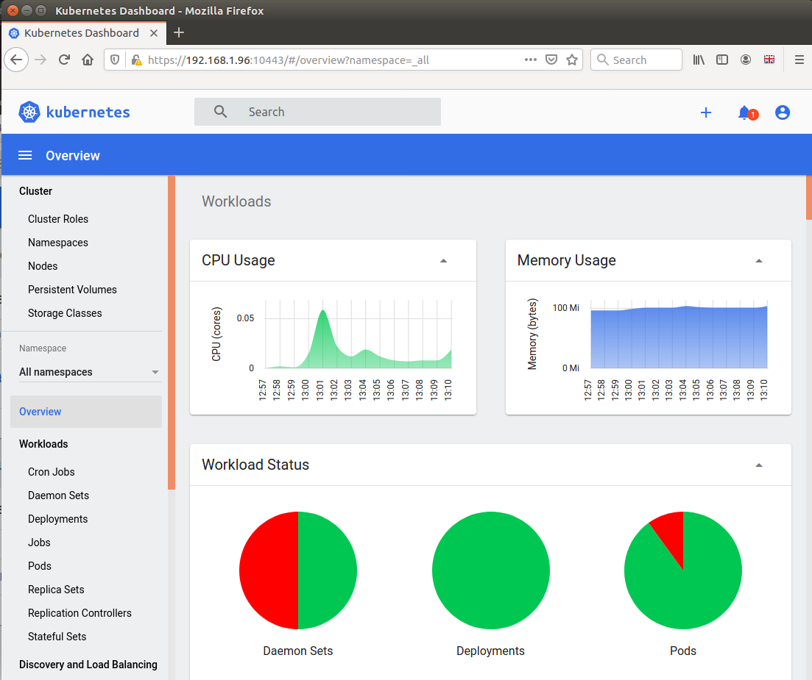

# Dashboard

We do not use the MicroK8s dashboard installation manifests for a 
[ couple of reasons](dashboard-background.md) .
In case its already installed we will **disable** it first.

``
microk8s disable dashboard
``

Instead we just install the upstream 
[ community version](https://github.com/kubernetes/dashboard#kubernetes-dashboard)

```bash
kubectl apply -f https://raw.githubusercontent.com/kubernetes/dashboard/v2.0.1/aio/deploy/recommended.yaml
```

Lets quickly check the installation. `192.168.1.100` is our server ip when following the prerequisites.

```bash
kubectl expose service kubernetes-dashboard --external-ip 192.168.1.100 --port 10443 --name dashboard -n kubernetes-dashboard
``` 

In your local browser open `https://192.168.1.100:10443`

A warning about an untrusted certificate will show up and upon confirmation and **in firefox**
you'd see the dashboards sign-in page. 

> **NOTE** In some chrome versions you do not get the option to bypass the `NET::ERR_CERT_INVALID` error.
Due to this
[**hidden function** in chrome](https://medium.com/@dblazeski/chrome-bypass-net-err-cert-invalid-for-development-daefae43eb12)
it is possible to just type **thisisunsafe** or **badidea** to proceed anyway. 


We take care of the untrusted certificate later.

For login next we create two users. One that has full admin rights and one with limited rights:

```bash
kubectl apply -f https://github.com/a-hahn/homekube/src/dashboard/create-admin-user.json
kubectl apply -f https://github.com/a-hahn/homekube/src/dashboard/create-simple-user.json
```
Now we inspect the created secrets (account tokens):

```bash
name=admin-user # or 'simple-user'
namespace=kubernetes-dashboard
token=$(kubectl -n $namespace get secret | grep ${name}-token | cut -d " " -f1)
kubectl -n $namespace describe secret $token 
``` 
From the output copy the **token:** secret in the DATA section (with a double click) to the clipboard and paste it
into `Enter token *` input field.



Now try the other token that we created for `simple-user` as well. The simple user has restricted rights. For example
he can't view any secrets.

**Congrats** The dashboard is up and running and exposed as a service !!
