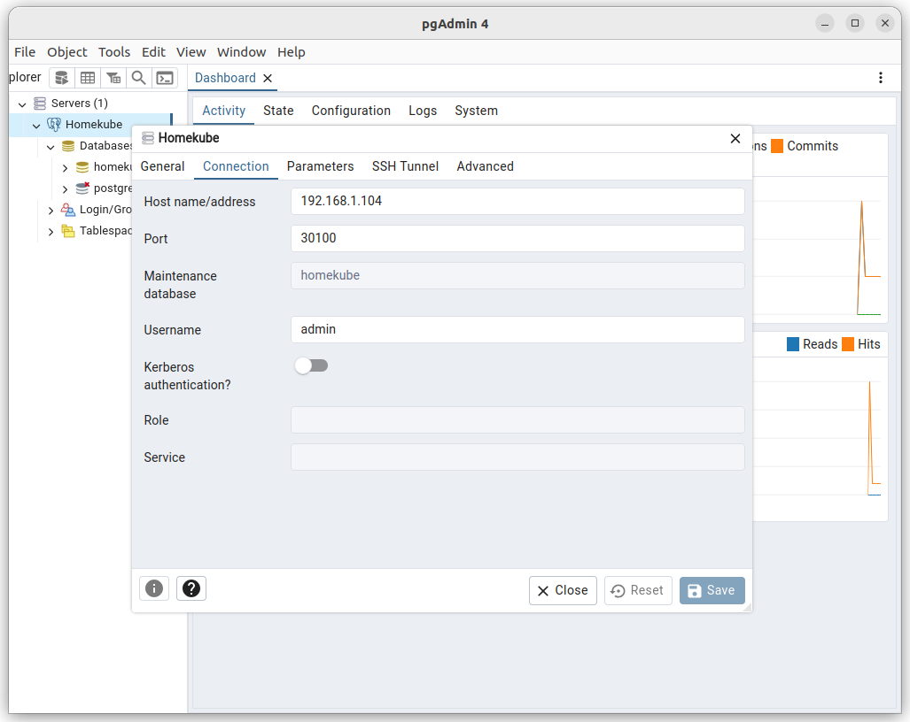
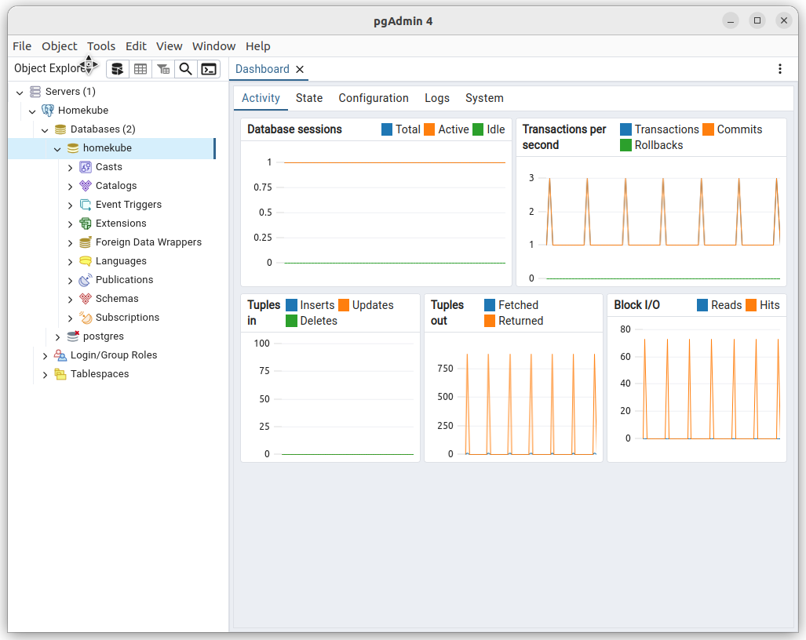

# Postgres

## Preparation
As we want to make use of the database from all kinds of clients - 
particualarly arm clients that don't have mass storage (e.g. raspberry pi) - 
we will put the database data files on external persistent storage which was created before.

Prerequisites are:
- A storage provisioner to fullfill persistence storage claims (e.g.
  [ NFS Storage](nfs.md)) This storage will be used to save all persistent postgres data

## Install postgres

```bash
cd ~/homekube/src/postgres
. ./install.sh
```
Once installed the postgres namespace should look like
```bash
root@auth:~# kubectl get all -n postgres
NAME         READY   STATUS    RESTARTS      AGE
pod/psql-0   1/1     Running   1 (19h ago)   21h

NAME                          TYPE       CLUSTER-IP      EXTERNAL-IP   PORT(S)          AGE
service/postgres-service-np   NodePort   10.152.183.37   <none>        5432:30100/TCP   21h

NAME                    READY   AGE
statefulset.apps/psql   1/1     21h

```

## Checking pod-local availability

```bash
# Step into the postgres pod with a bash shell
kubectl exec -it -n postgres psql-0 -- bash 
# Connect with the postgres (or homekube) database
psql -U admin -d postgres
```
As an admin user with local admin permissions connect with the postgres (or homekube)
database and execute ``\l`` for a list of existing databases. Then ``\q`` will quit psql.  
**NOTE** that we don't need to specify a host as localhost is the default and we don't need
to authenticate as long as
1) the user exist with sufficient privileges (We created user admin [during installation of postgres](../src/postgres/postgres-nfs.yaml) )
2) [Trust authentication](https://www.postgresql.org/docs/current/auth-trust.html) is configured for local access (default)

```bash
root@psql-0:/# psql -U admin -d postgres
psql (16.3 (Debian 16.3-1.pgdg120+1))
Type "help" for help.

postgres=# \l
                                                   List of databases
   Name    | Owner | Encoding | Locale Provider |  Collate   |   Ctype    | ICU Locale | ICU Rules | Access privileges 
-----------+-------+----------+-----------------+------------+------------+------------+-----------+-------------------
 homekube  | admin | UTF8     | libc            | en_US.utf8 | en_US.utf8 |            |           | 
 postgres  | admin | UTF8     | libc            | en_US.utf8 | en_US.utf8 |            |           | 
 template0 | admin | UTF8     | libc            | en_US.utf8 | en_US.utf8 |            |           | =c/admin         +
           |       |          |                 |            |            |            |           | admin=CTc/admin
 template1 | admin | UTF8     | libc            | en_US.utf8 | en_US.utf8 |            |           | =c/admin         +
           |       |          |                 |            |            |            |           | admin=CTc/admin
(4 rows)

postgres=# \q
root@psql-0:/# 
```

## Checking availability from inside the cluster

Now lets do another check to confirm that we can connect to the database from inside the cluster. For this we install
another instance of postgres. Actually we only need the psql client but its just simpler to use the same image.

```bash
kubectl run -it postgres --image=postgres:16 --restart=Never -- bash
# then execute
psql -U admin postgresql://postgres-service-np.postgres/homekube
```
We connect with user ``admin`` via the ``postgresql`` driver to the service instance ``postgres-service-np``
in the namespace ``postgres`` to the database ``homekube``.  
As this is cluster-local in contrast to pod-local
[Trust authentication](https://www.postgresql.org/docs/current/auth-trust.html) doesn't kick in and we need to supply credentials for authorization.

```bash
root@postgres:/# psql -U admin postgresql://postgres-service-np.postgres/homekube
Password for user admin: 
psql (16.3 (Debian 16.3-1.pgdg120+1))
Type "help" for help.

homekube=# \l
                                                   List of databases
   Name    | Owner | Encoding | Locale Provider |  Collate   |   Ctype    | ICU Locale | ICU Rules | Access privileges 
-----------+-------+----------+-----------------+------------+------------+------------+-----------+-------------------
 homekube  | admin | UTF8     | libc            | en_US.utf8 | en_US.utf8 |            |           | 
 postgres  | admin | UTF8     | libc            | en_US.utf8 | en_US.utf8 |            |           | 
 template0 | admin | UTF8     | libc            | en_US.utf8 | en_US.utf8 |            |           | =c/admin         +
           |       |          |                 |            |            |            |           | admin=CTc/admin
 template1 | admin | UTF8     | libc            | en_US.utf8 | en_US.utf8 |            |           | =c/admin         +
           |       |          |                 |            |            |            |           | admin=CTc/admin
(4 rows)

homekube=# \q
root@postgres:/# 
```
```shell
# cleanup - remove the helper pod
kubectl delete po postgres
```

## Checking external availability

External availability is a very useful option for deeper inspection of the database during development.
For this we need to install the postgres client on our developer machine in the local network.
Or as an alternative we can use a client wih a visual ui. There a various options and I'm using "official" 
[postgres frontend pgAdmin](https://www.pgadmin.org). It offers numerous installation 
option for the different os and a web based version too.

Lets first check the ip address of our lxc container containing our homekube cluster in the local network:
```bash
ubuntu@pi1:~$ lxc list homekube
+----------+---------+-----------------------------+------+-----------+-----------+
| NAME     |  STATE  |            IPV4             | IPV6 |   TYPE    | SNAPSHOTS |
+----------+---------+-----------------------------+------+-----------+-----------+
| homekube | RUNNING | 192.168.1.104 (eth0)        |      | CONTAINER | 0         |
|          |         | 10.1.103.192 (vxlan.calico) |      |           |           |
+----------+---------+-----------------------------+------+-----------+-----------+
```

Install the client on your developer machine following the [instructions](https://www.pgadmin.org)
Create a server with the following properties:

1) On the **General** tab name the service as you like, e.g. "Homekube"  
2) On the **Connection** tab fill in the values from our configuration.  
2.1) The hostname/address is the IP of the clusters host in your local network (e.g. ``192.168.1.104``)  
2.2) The port is the ``nodePort`` (``30100``) we configured [during database creation](../src/postgres/postgres-nfs.yaml)   
2.3) As the maintenance database we can either specify ``postgres`` or ``homekube``   
2.4) Username is ``admin`` as given during installation  
2.5) Password is the ``${HOMEKUBE_PG_PASSWORD}`` from your environment settings during installation 

  



## Cleanup

```bash
kubectl delete ns postgres
kubectl delete pv psql-pv
```

## Useful tips

### Create a scram-sha-256 hash

This is useful to avoid using plain text passwords. Postgres supports md5 and scram-sha-256 hashes.
It is a better approach to use passwords in environment variables. Thats what we do in our install.sh scripts.
This is an alternative way (which is considered less safe) to supply passwords. 
Here is an easy way to create one.

```bash
# psql into our homekube database with admin permissions
root@auth:~# kubectl exec -it -n postgres psql-0 -- psql -U admin -d homekube
psql (16.3 (Debian 16.3-1.pgdg120+1))
Type "help" for help.

homekube=# 
```

Lets create a user 'test' and assign a password of your choice (e.g. 'your_password')
```psql
show password_encryption; -- should be 'scram-sha-256' (default from Postgres version 14) or older 'md5'
-- SET password_encryption  = 'scram-sha-256'; -- or ALTER SYSTEM SET password_encryption = 'scram-sha-256';
CREATE USER test with password 'your_password';
SELECT rolpassword FROM pg_catalog.pg_authid WHERE rolname = 'test';
drop user test;
\q
```

Use the rolpassword from console output
```
CREATE ROLE
                                                              rolpassword                                                              
---------------------------------------------------------------------------------------------------------------------------------------
 SCRAM-SHA-256$4096:tTGGLga+/GtT1SeNTvE84w==$omR6+uiZE2VQlW6afdI/Q1+5P9i+G3ush3YqSeXn46I=:7JYgIBChLnwjIHpmjkflyUTWnp97laRChQRxdex5to8=
(1 row)

```

Use the whole prompt as password e.g.  
``SCRAM-SHA-256$4096:tTGGLga+/GtT1SeNTvE84w==$omR6+uiZE2VQlW6afdI/Q1+5P9i+G3ush3YqSeXn46I=:7JYgIBChLnwjIHpmjkflyUTWnp97laRChQRxdex5to8=``
