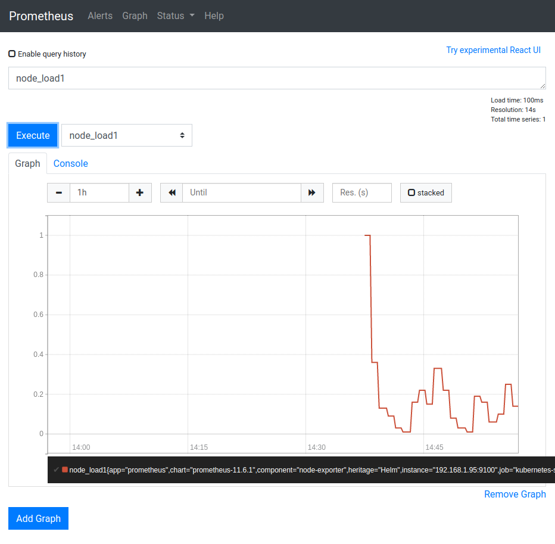

# Prometheus

What is prometheus ? From the
[ Prometheus docs](https://prometheus.io/docs/introduction/overview/) :  

> Prometheus is an open-source systems monitoring and alerting toolkit originally built at SoundCloud. Since its inception in 2012, many companies and organizations have adopted Prometheus, and the project has a very active developer and user community.

Prometheus architecture (from their website):

[](https://prometheus.io/docs/introduction/overview/)

In this tutorial we use prometheus and its time-series data storage for collecting 
data and preparing its visualisation (with Grafana).

## Preparation

Prerequisites are: 
- [ Helm](helm.md)
- A storage provisioner to fullfill storage claims (e.g. 
[ NFS Storage](nfs.md))


## Installation

For installation we will use the
[  stable/prometheus](https://github.com/helm/charts/tree/master/stable/prometheus)
chart. It offers lots of options but for now we focus on the server component and disable
the pushgateway and the alertmanager. The important setting is

- server.persistentVolume.storageClass=**managed-nfs-storage**  
StorageClass name must match existing storage provisioner settings

```bash
kubectl create namespace prometheus
helm install prometheus -n prometheus --version=11.6.1 \
--set alertmanager.enabled=false \
--set pushgateway.enabled=false \
--set server.persistentVolume.storageClass=managed-nfs-storage \
stable/prometheus
```
Output:
```text
NAME: prometheus
LAST DEPLOYED: Wed Jul  8 16:37:02 2020
NAMESPACE: prometheus
STATUS: deployed
REVISION: 1
TEST SUITE: None
NOTES:
The Prometheus server can be accessed via port 80 on the following DNS name from within your cluster:
prometheus-server.prometheus.svc.cluster.local


Get the Prometheus server URL by running these commands in the same shell:
  export POD_NAME=$(kubectl get pods --namespace prometheus -l "app=prometheus,component=server" -o jsonpath="{.items[0].metadata.name}")
  kubectl --namespace prometheus port-forward $POD_NAME 9090


#################################################################################
######   WARNING: Pod Security Policy has been moved to a global property.  #####
######            use .Values.podSecurityPolicy.enabled with pod-based      #####
######            annotations                                               #####
######            (e.g. .Values.nodeExporter.podSecurityPolicy.annotations) #####
#################################################################################

For more information on running Prometheus, visit:
https://prometheus.io/
```

**IMPORTANT**
From the output we need to remember the servers url as we later need this for configuration of
the datasource of the Grafana dashboard:  
**prometheus-server.prometheus.svc.cluster.local**

## Testing 
Following the output instructions we can test our installation. Note the appending `--address=0.0.0.0`
which may be necessary in some local installations.
```bash
export POD_NAME=$(kubectl get pods --namespace prometheus -l "app=prometheus,component=server" -o jsonpath="{.items[0].metadata.name}")
kubectl --namespace prometheus port-forward $POD_NAME 9090 --address=0.0.0.0
```
Now open a browser on **http://192.168.1.100:9090** and explore prometheus native web interface.



## Public Exposure

Optionally deploy the Prometheus UI as an Ingress to the public. We do it here for the purpose of demonstration but of course 
in general thats not recommended for security reasons.

```bash
kubectl apply -f ~/homekube/src/prometheus/ingress-prometheus.yaml
```

Now access 
[ https://prometheus.homekube.org](https://prometheus.homekube.org)

## Cleanup

In case you want to remove the installation (e.g. reinstall ....)

```bash
helm uninstall prometheus --namespace=prometheus
kubectl delete namespace prometheus
helm list --all-namespaces
```

## Next steps

Next install the 
[ Grafana dashboard](grafana.md) 
to visualize all those metrics scraped by prometheus.

## Tutorials

 - [  
21:31 How Prometheus Monitoring works](https://www.youtube.com/watch?v=h4Sl21AKiDg)  
 Prometheus Architecture explained 
 [[Techworld with Nana](https://www.youtube.com/channel/UCdngmbVKX1Tgre699-XLlUA)]   
 - [  34:09 Prometheus monitoring for Kubernetes Cluster and Grafana visualization](https://www.youtube.com/watch?v=CmPdyvgmw-A)  
 [[Just me and Opensource](https://www.youtube.com/channel/UC6VkhPuCCwR_kG0GExjoozg)] 
